# Swift-ONNX-CoreML

A Swift package for geospatial classification, leveraging **C++ interop**, **ONNX Runtime**, and **Core ML** for flexible model inference.

## Features

* **Swift–C++ Interoperability:** Seamlessly integrates high-performance C++ classification logic for native execution speed.

* **ONNX Runtime Integration:** Supports ONNX models via the [onnxruntime](https://onnxruntime.ai) binary dependency.

* **Core ML Integration:** Provides a pure-Swift classifier (`SwiftClassifier`) that dynamically loads `.mlmodelc` models at runtime, enabling direct use of Apple’s Core ML framework — no autogenerated Swift model code required.

* **Resource Bundling:** Includes necessary assets (ONNX or Core ML models, evaluation data) directly within the Swift package for clean deployment.

* **CLI Executable:** Offers a command-line tool (`testClassifier1`) for testing and evaluation on macOS.

## Requirements

* **Swift Toolchain:** Swift 6.1 or later  
* **Platforms:** macOS 15.0+ and iOS 16.0+  
* **C++ Standard:** Requires C++23 support (as defined in `Package.swift`)

## Installation

### Swift Package Manager (Recommended)

```swift
.package(url: "https://github.com/mi-parkes/Swift-ONNX-CoreML.git", from: "1.0.0")
```

<p align="center">
Swift-ONNX-CoreML Package Dependency Graph
<br><br>

</p>

